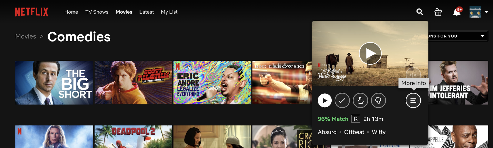
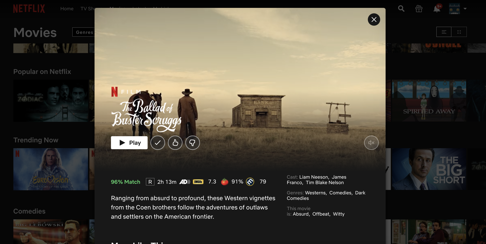

# NetFix
NetFix is a Chrome extension that conveniently displays IMDb, Rotten Tomatoes, and Metacritic ratings when previewing Netflix titles in the Google Chrome browser. This extension was created to be compatible with Netflix's new UI changes. The extension makes use of the OMDbAPI (http://www.omdbapi.com/) to obtain the displayed ratings.

## Installation
1. Download the extension (this repository)
2. Obtain a free API key from http://www.omdbapi.com/apikey.aspx
3. Open the `netfix.js` file and insert the key in the in the first line
```var api_key = "1aa1a11a";
// ^^INSERT YOUR API KEY HERE
```
4. Navigate to `chrome://extensions` in your Chrome browser
5. Ensure developer mode is enabled
6. Click "Load unpacked" and select the net-fix folder

## Usage
The ratings will appear when you click the `More info` button on Netflix titles


